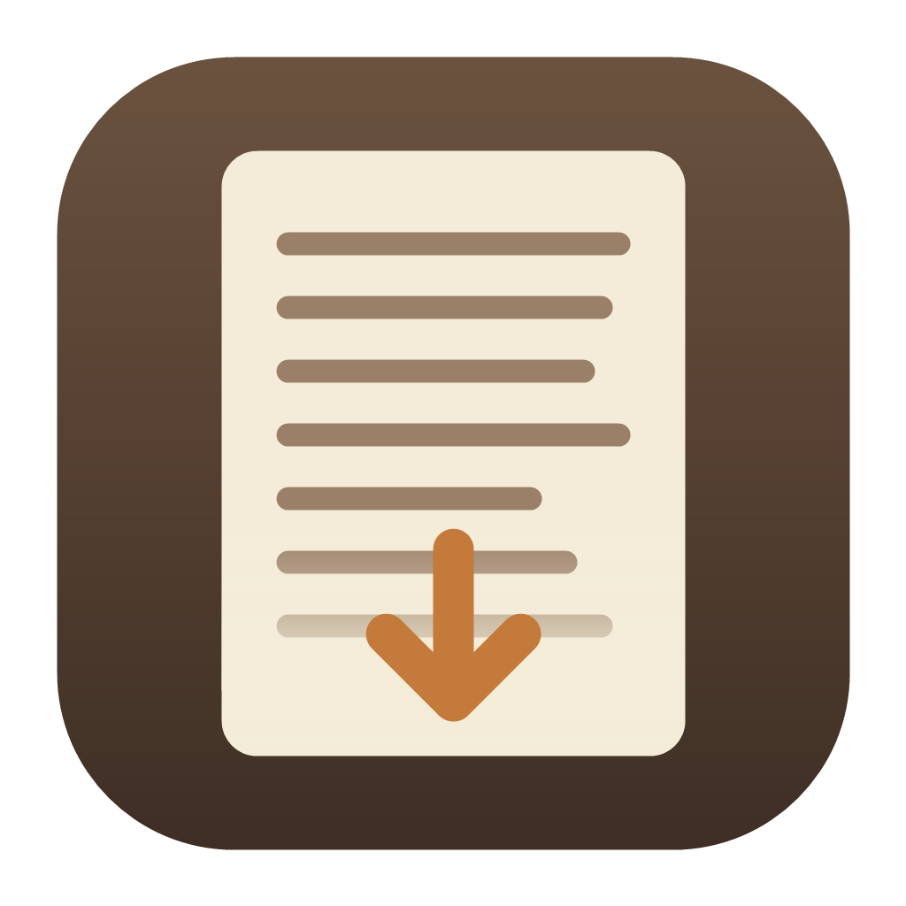
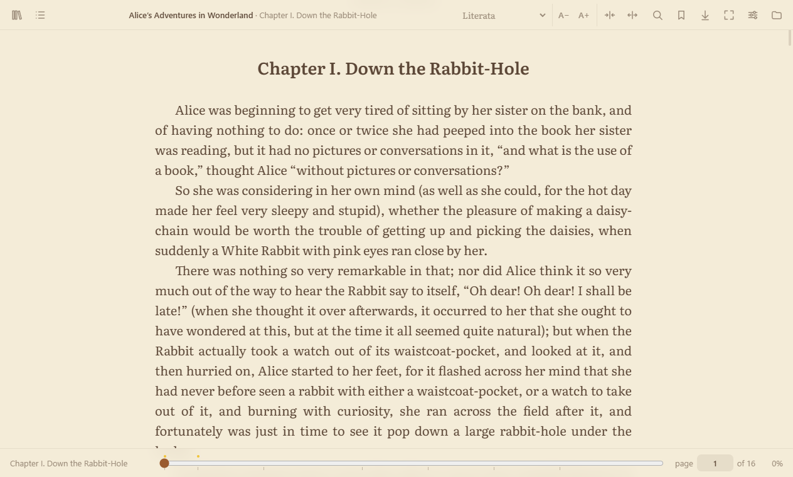
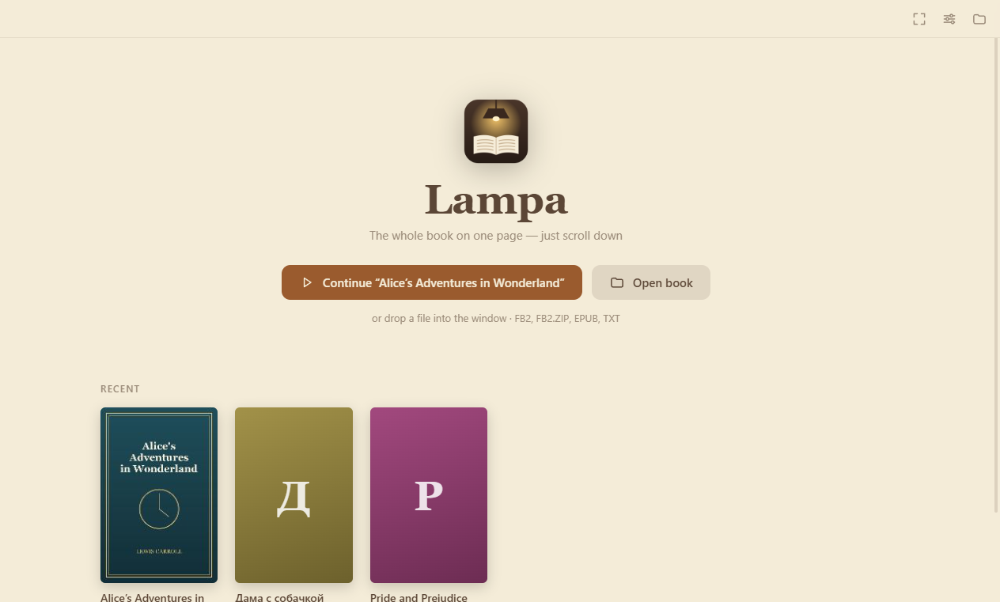
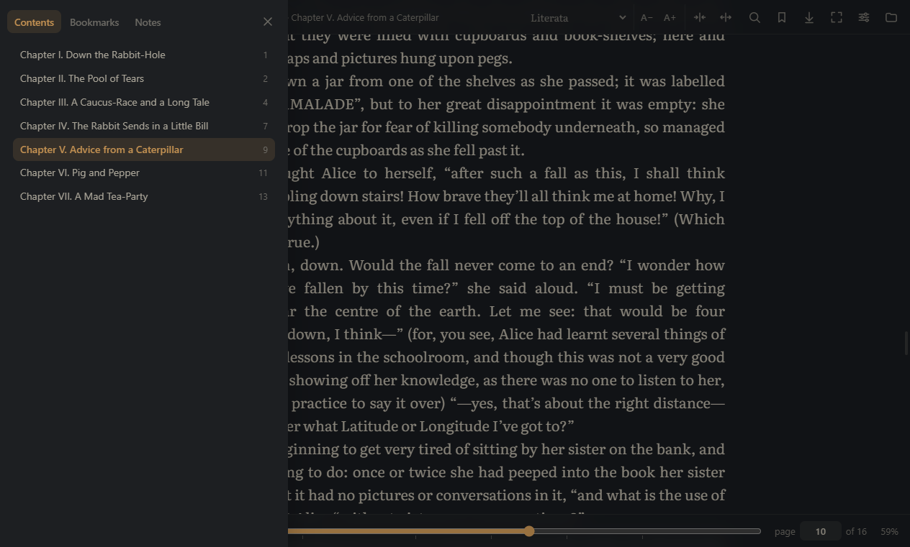
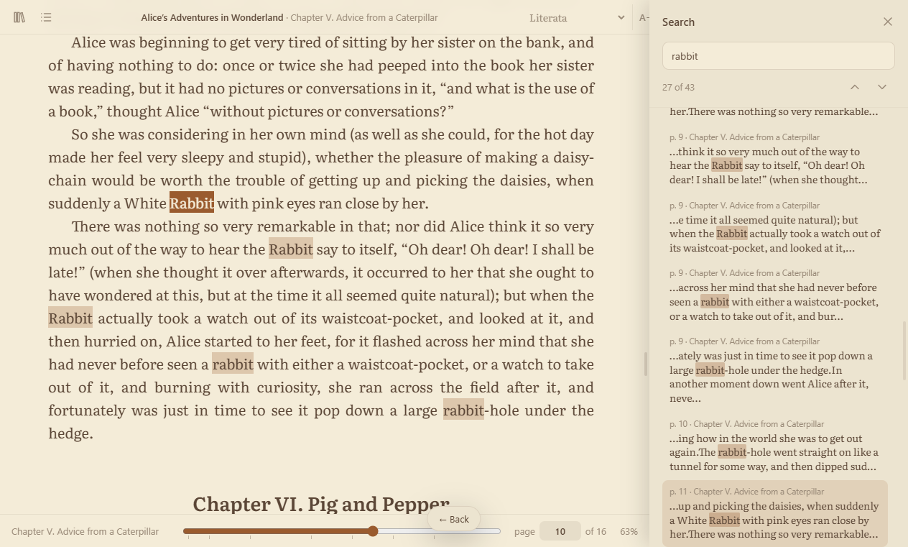
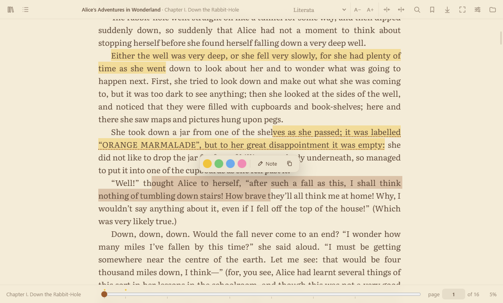
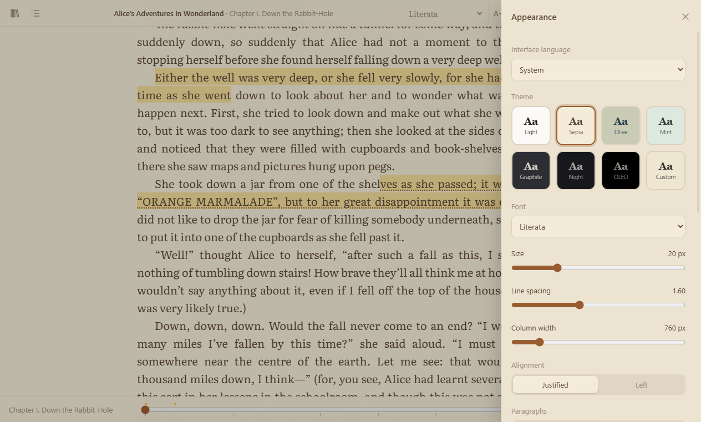

<p align="center">
  
</p>

<h1 align="center">Lampa</h1>

<p align="center">
  Спокойная читалка для Windows, macOS и Linux. Книга открывается одной непрерывной лентой: просто листайте вниз.<br>
  FB2 · EPUB · TXT
</p>

<p align="center">
  <a href="README.md">English</a> · <b>Русский</b>
</p>

<p align="center">
  
</p>

## Скачать

| Система | Файл | Примечание |
| --- | --- | --- |
| **Windows** 10 / 11 | [**Lampa-Setup.exe**](https://github.com/Zelinsky-Vladimir/lampa/releases/latest/download/Lampa-Setup.exe) | Установщик. Добавляет ярлыки в «Пуск» и на рабочий стол, открывает `.fb2` / `.epub` и обновляется сам. |
| Windows без установки | [Lampa-Portable.exe](https://github.com/Zelinsky-Vladimir/lampa/releases/latest/download/Lampa-Portable.exe) | Запускается из любой папки или с флешки. Сам не обновляется. |
| **macOS**, Apple Silicon (M1–M4) | [Lampa-mac-arm64.dmg](https://github.com/Zelinsky-Vladimir/lampa/releases/latest/download/Lampa-mac-arm64.dmg) | См. [установку на macOS](#macos). |
| macOS, Intel | [Lampa-mac-x64.dmg](https://github.com/Zelinsky-Vladimir/lampa/releases/latest/download/Lampa-mac-x64.dmg) | |
| **Linux**, любой дистрибутив | [Lampa-linux-x86_64.AppImage](https://github.com/Zelinsky-Vladimir/lampa/releases/latest/download/Lampa-linux-x86_64.AppImage) | Один файл, обновляется сам. |
| Linux, Debian / Ubuntu | [Lampa-linux-amd64.deb](https://github.com/Zelinsky-Vladimir/lampa/releases/latest/download/Lampa-linux-amd64.deb) | |

Все версии и списки изменений лежат на странице [Releases](https://github.com/Zelinsky-Vladimir/lampa/releases).

## Возможности

- **Одна лента.** Страницы не перелистываются: книга идёт сверху вниз, а Lampa запоминает, где вы остановились.
- **Настоящие номера страниц.** Страница равна 1800 знакам, как в печатной книге, поэтому «стр. 124» не меняется от шрифта и размера окна. К любой странице можно перейти, введя её номер.
- **Полоса прогресса** с отметками глав, закладок и заметок. Её можно тащить, при этом видны страница и глава.
- **Поиск** по всей книге: список совпадений со страницей и главой, подсветка в тексте.
- **Закладки, выделения и заметки.** Выделите текст, чтобы отметить его одним из четырёх цветов или добавить заметку. Всё собирается в боковой панели, и все заметки можно скопировать разом в Markdown.
- **Темы:** светлая, сепия, олива, мята, графит, ночь, OLED и своя: цвет фона и цвет текста выбираются отдельно, с подсказкой по контрасту.
- **Яркость внутри приложения** от 30 до 100 % в один щелчок (☀ в верхней панели), независимо от монитора.
- **21 шрифт,** в том числе 14 встроенных шрифтов для чтения с кириллицей (Literata, PT Serif, Merriweather, Lora, EB Garamond, Inter и другие). Они выглядят одинаково на любой системе.
- **Масштаб на всю ширину.** `Ctrl` `+` / `−` (или `Ctrl` + колёсико) увеличивает шрифт и колонку вместе, и текст занимает широкий монитор, а не узкую полосу посередине. Ширину колонки можно менять и отдельно.
- **Автопрокрутка** с регулировкой скорости прямо на экране.
- **Перевод выделенного** через Google Translate: само слово или фраза, словарные варианты для отдельного слова и перевод всего предложения вокруг, чтобы было видно, какое значение здесь имеется в виду. Сохраняется в заметку одним щелчком.
- **Сноски** всплывают на месте, место чтения не теряется.
- **Любая кодировка.** Старые книги в windows-1251, KOI8, CP866 открываются без кракозябр.
- **Интерфейс на пяти языках:** English, Русский, Français, Deutsch, Español.
- **Приватно.** Книги никуда не отправляются. В интернет Lampa ходит только за обновлениями на GitHub и, когда вы нажимаете «Перевести», отправляет выделенный текст с предложением в Google Translate.

## Скриншоты

| | |
| --- | --- |
|  |  |
| **Библиотека:** недавние книги с обложками и прогрессом | **Ночная тема:** оглавление с номерами страниц |
|  |  |
| **Поиск:** все совпадения со страницей и главой | **Выделения и заметки** по выделенному тексту |
|  | |
| **Оформление:** язык, темы, шрифты, раскладка | |

## Установка

### Windows

1. Скачайте **Lampa-Setup.exe** и запустите.
2. Если SmartScreen пишет «Система Windows защитила ваш компьютер», нажмите **Подробнее → Выполнить в любом случае**. У приложения нет платной цифровой подписи, но весь код открыт, а сборки делает [GitHub Actions](https://github.com/Zelinsky-Vladimir/lampa/actions).
3. Lampa появится в «Пуске» и на рабочем столе, а `.fb2` и `.epub` будут открываться двойным щелчком.

Попробовать без установки можно в **Lampa-Portable.exe**.

### macOS

1. Скачайте `.dmg` под ваш Mac: **arm64** для Apple Silicon (M1–M4), **x64** для Intel. Посмотреть можно в меню  → «Об этом Mac».
2. Откройте файл и перетащите **Lampa** в «Программы».
3. В первый раз запустите так: **правый щелчок по Lampa → Открыть → Открыть**. Приложение не проверено Apple, поэтому обычный запуск один раз блокируется.
4. Если macOS пишет «Программа повреждена», выполните один раз в Терминале:
   ```bash
   xattr -cr /Applications/Lampa.app
   ```

### Linux

**AppImage (любой дистрибутив):**

```bash
chmod +x Lampa-linux-x86_64.AppImage
./Lampa-linux-x86_64.AppImage
```

**Debian / Ubuntu:**

```bash
sudo apt install ./Lampa-linux-amd64.deb
```

## Обновления

Установленная версия для Windows и AppImage для Linux при запуске проверяют [Releases](https://github.com/Zelinsky-Vladimir/lampa/releases). Новая версия скачивается в фоне. Нажмите «Перезапустить» на появившейся плашке, или она установится сама при закрытии Lampa. Переносной `.exe`, `.deb` и версия для macOS сами не обновляются, их нужно скачивать заново.

## Клавиши

| Клавиши | Действие |
| --- | --- |
| `Пробел` / `PgDn`, `Shift+Пробел` / `PgUp` | Страница вниз / вверх |
| `↑` `↓`, `Home` / `End` | Прокрутка на пару строк, в начало / конец |
| `Ctrl+F`, `Enter` / `F3` | Поиск, следующее совпадение (`Shift` — предыдущее) |
| `Ctrl+G` | Перейти к странице |
| `T` | Оглавление, закладки и заметки |
| `B` | Закладка на текущей странице |
| `S` | Оформление |
| `A`, `[` `]` | Автопрокрутка, медленнее / быстрее |
| `Ctrl` `+` / `−` / `0`, `Ctrl` + колёсико | Масштаб (шрифт и колонка вместе), сброс |
| `Ctrl+Shift+←` / `→` | Колонка уже / шире |
| `Ctrl+O` | Открыть книгу |
| `F11` | Полный экран |
| `Esc` | Закрыть панель, подсказку или поиск |

## Сборка из исходников

Сборка и устройство проекта описаны в [английском README](README.md#building-from-source). Коротко:

```bash
git clone https://github.com/Zelinsky-Vladimir/lampa.git
cd lampa
npm install
npm start
```

## Лицензия

[MIT](LICENSE). Встроенные шрифты распространяются по лицензии SIL Open Font License, тексты лицензий лежат в [`src/fonts/licenses`](src/fonts/licenses). Книги на скриншотах в общественном достоянии.
